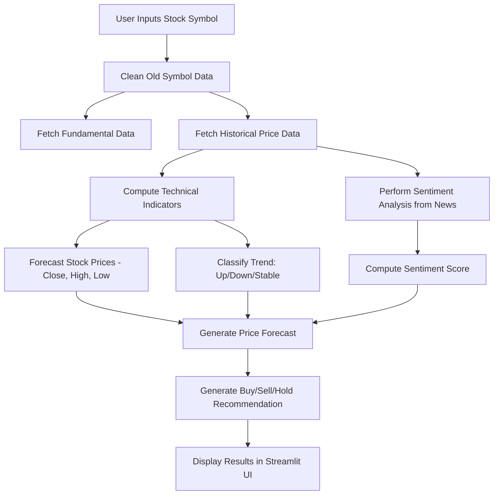

# Stock Prediction Project

## Overview

This project aims to develop a comprehensive stock prediction system that leverages historical data, technical indicators, and machine learning models to forecast stock prices and trends. The system includes data collection, feature engineering, model training, and a real-time prediction API.

## Project Structure

```
StockPrediction
├── Data/
│   ├── <Symbol ex : AAPL, GOOG>/      
│   ├────stock_data_<Symbol>.csv                  # Stocks Fundamentals 
│   ├────technical_indicators_<Symbol>.csv        # Technical data for stocks
│   ├── Sentiment_Analysis/
│   ├────sentiment_history_<Symbol>.csv           # Sentiment Analysis information
│   ├── last_run_date.txt                         # Cleans Fundamentals, Technical, Sentiment analysis & price_forecast & trend_classification models everyday based on the date captured
├── Models/
│   ├── price_forecast/                          # Models for price forecasting
│   ├── trend_classification/                    # Models for trend classification
├── Src/
│   ├── Api.py                                   # FastAPI server stock predictions API
│   ├── Clean_Symbol_Information.py              # Cleans Fundamentals, Technical, Sentiment analysis & price_forecast & trend_classification models
│   ├── Data_loader.py                           # Fetches historical and real-time stock data
│   ├── MarketSentimentAnalysis.py:              # Trains  sentiment analysis from news
│   ├── Price_forecast.py                        # Trains stock price forecasting model
│   ├── Real_Time_Predict.py                     # Fetches live stock data for predictions
│   ├── Technical_Indicators.py                  # Computes technical indicators & custom ZigZag
│   ├── Trend_Classification.py                  # Trains trend classification model
│   ├── UI.py                                    # Streamlit User Interface interacts with API to fetch stock information & predicts the trend movement
├── notebooks/                                   # Jupyter notebooks for analysis and testing
├── requirements.txt                             # Dependency list
└── README.md                                    # Project documentation
```

## Features

- **Fundamental Analysis**
  - Market Cap, P/E Ratio, EPS, Dividend Yield, Sector, Industry
- **Technical Indicators**
  - Simple Moving Averages (SMA) - 20-day, 200-day
  - Exponential Moving Averages (EMA) - 20-day, 200-day
  - Displaced Moving Averages (DMA): 20-day, 50-day, and 200-day
  - Relative Strength Index (RSI): 7-day, 14-day, and 200-day
  - Moving Average Convergence Divergence (MACD)
  - Average True Range (ATR)
  - On-Balance Volume (OBV)
  - ZigZag Trend Analysis

- **Sentiment Analysis**
  - Fetches and evaluates latest market news sentiment for given stock symbols.

- **Stock Price Forecasting**
  - Predicts future Closing, High, and Low prices using advanced ML models.

- **Trend Classification**
  - Predicts if the stock is in an Uptrend 📈, Downtrend 📉, or Stable ⚖️, and provides a trend strength score.

- **Real-Time Stock Prediction**
  - Provides immediate prediction for the latest stock prices based on live indicators.

- **Recommendation System**
  - Suggests actionable recommendations (Buy, Hold, or Sell) based on the combined analysis of trends and market sentiment.

## Installation

1. **Clone the Repository**:

   ```bash
   git clone https://github.com/guruthanglearning/AILearning.git
   cd stock_prediction_project
   ```

2. **Set Up a Virtual Environment**:

   ```bash
   python -m venv venv
   source venv/bin/activate  # On Windows, use `venv\Scripts\activate`
   ```

3. **Install Dependencies**:

   ```bash
   pip install -r requirements.txt
   ```

## Usage

1. **Data Collection**:

   - Run `Data_loader.py` to fetch and store historical stock data.
     ```powershell
     python ./Src/Data_loader.py
     ```

2. **Technical Indicators**:

   - Execute `Technical_Indicators.py` to compute and save technical indicators.
     ```powershell
     python  ./Src/Technical_Indicators.py
     ```

3. **Model Training**:

   - Train the price forecasting model:
     ```powershell
     python ./Src/Price_Forecast.py
     ```
   - Train the trend classification model:
     ```powershell
     python ./Src/Trend_Classification.py
     ```

4. **Real-Time Predictions**:

   - Use `Real_Time_Predict.py` to fetch live data and make predictions.
     ```powershell
     python ./Src/Real_Time_Predict.py
     ```

5. **API Deployment**:

   - Start the FastAPI server to serve real-time predictions.
     ```bash
     uvicorn Src.Api:app --reload
     ```
   - Access the API documentation at `http://127.0.0.1:8000/docs`.

6. **UI Deployment**:
 - Start the Streamlit UI to show the API response
     ```powershell
     streamlit run ./Src/UI.py
     ```
   - Access the API documentation at `http://127.0.0.1:8000/docs`.
   
8. **Clean Up**
   - Use Clean_Symbol_Information.py to remove data files from Data & pre-trained model files from Model folder
      ```powershell
     python ./Src/Clean_Symbol_Information.py
     ```
9. **Workflow Diagram**

## Contributing

Contributions are welcome! Please fork the repository and submit a pull request for any enhancements or bug fixes.


## Disclaimer

This software is for educational purposes only. Use it at your own risk. The authors and all affiliates assume no responsibility for your trading results. Do not risk money which you cannot afford to lose.


https://github.dev/github/dev
