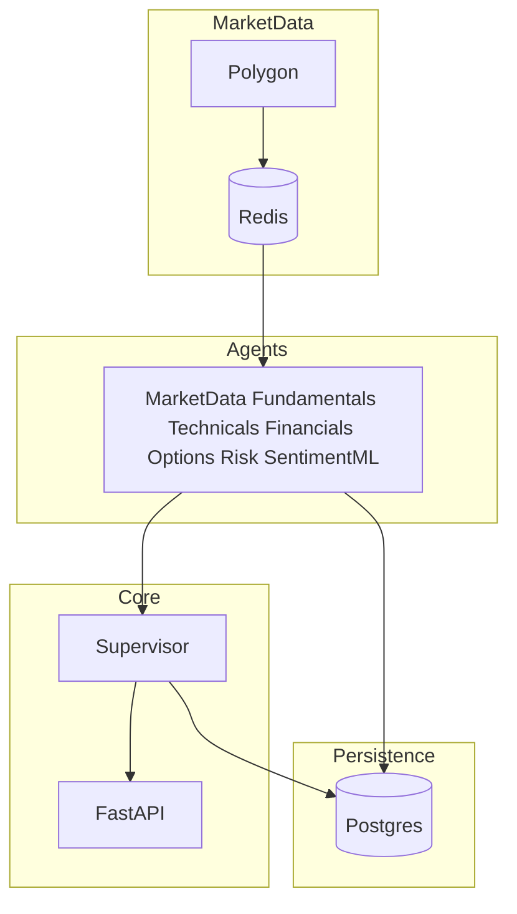

# Master plan: StockRecommendationPlatform

## Document control

**`docs/MASTER_PLAN.md` is the sole source of truth** for this repository: scope, architecture, vendor choice, phases, acceptance criteria, backlog, and SDLC. Work should be **traceable** here or in issues that cite section numbers. Update this file when scope or architecture changes (same PR as code, or a prior PR).

---

## 1. Purpose, goals, and scope

- **Production-grade:** Reliable, observable, explicit about **data freshness**—not a demo.
- **Multi-agent:** One domain per agent, structured outputs; **supervisor** produces a **stock vs options** verdict, **decision aids**, and (planned) **options metrics table**.
- **Real-time:** Quotes and option chains via **Polygon → Redis → agents** (**§1.2**), not production reliance on delayed scrapes.
- **Positioning:** **Research / education**, not personalized advice; hypothetical scenarios; **no auto-trading** without licensed broker integration.
- **Universe:** Curated sets first (e.g. S&P 500 subsets); scale batch and licensing deliberately.

**Non-goals (early):** Retail execution, guaranteed NBBO everywhere, acting as a licensed advisor.

### 1.1 Universe and batch processing

| Mode | Requirement |
|------|----------------|
| **Single symbol** | **Mandatory default:** `POST /v1/analysis/run` or `GET .../run/{symbol}` → one **`SupervisorVerdict`**. |
| **S&P 500 full** | Async job: `202` + `job_id`, poll/SSE, Postgres per symbol—not one blocking request for ~500 analyses. |
| **S&P 500 top 10 / top 100** | Same job pattern; document max sync size if any dev shortcut; default **async**. |

**“Top N” definition:** Document in OpenAPI: default **index weight** (or **market cap** if weights unavailable) + **`composition_as_of`**. Optional `ranking_method` if you add alternates later.

**Source of truth:** Versioned constituent list or index API; store `composition_as_of` on each batch run.

**Batch NFR:** Rate limits and concurrency for **Polygon** (prod) and `yfinance` (dev); per-symbol failure must not kill the whole job; optional `batch_key` for idempotency.

### 1.2 Market data: Polygon

**Decision:** **[Polygon](https://polygon.io/)** is the **primary production** source for US **equities**, **options** (chains, quotes/trades as subscribed), and related REST/WebSocket feeds—per your **subscription SKUs** and contract.

**Implement (per SKU):** MarketData from Polygon; OptionsAgent + **§6.2** from Polygon chain fields; ingest **WS and/or REST** → **Redis**; cache-first agents + `quote_stale_seconds`; batch jobs respect Polygon **429** limits; **`data_freshness`** uses vendor/ingest timestamps when wired.

**Verify in contract:** Display/redistribution if end users see live prices; delayed vs real-time exchange rules; stable **API base URL and auth** (ignore consumer marketing name drift).

**Secrets:** `POLYGON_API_KEY` via pydantic-settings / secret manager—never in git or browsers. **`yfinance`:** dev/fallback until Polygon paths are stable in CI and prod.

---

## 2. Current baseline

| Area | Today |
|------|--------|
| API | [`app/main.py`](../app/main.py) — `healthz`, `POST /v1/analysis/run`, `GET .../run/{symbol}` |
| Schemas | [`app/schemas/agents.py`](../app/schemas/agents.py) |
| Orchestration | [`app/supervisor.py`](../app/supervisor.py) |
| Decision aids | [`app/decision_support.py`](../app/decision_support.py) |
| Agents | MarketData, Fundamentals, Technicals, Financials, Options, RiskProWorkflow, SentimentML ([`config`](../app/config.py)) |
| Data | `yfinance` only—not production. Target: **Polygon → Redis → agents**. |
| Infra | Redis + Postgres in [`docker-compose.yml`](../docker-compose.yml) (placeholders) |
| Tests | [`tests/test_supervisor_and_decision.py`](../tests/test_supervisor_and_decision.py) |
| Batch | Single-symbol only; **§1.1** presets and job API **not built** yet. |

---

## 3. Boundaries

Do **not** fold external ML training stacks, vendor ingest, or orchestration into a separate training repo. Keep an **optional Sentiment/ML HTTP service** (env URL) as a thin client only—same contract as today’s `SentimentMLAgent`. Prefer small **contract-stable** JSON tweaks over coupling codebases.

---

## 4. Architecture

### 4.1 Data flow and persistence

### 4.2 Supervisor rules

- Supervisor **does not** call Yahoo or Polygon directly—it **runs agents** (e.g. `asyncio.gather`), enforces timeouts, surfaces partial failure (e.g. options degraded → stock-only path with clear note).
- Merge is **deterministic** from structured fields. Optional LLM may **summarize** only with guardrails (no new numbers; cite agent fields).

### 4.3 API contract (evolve without breaking consumers unintentionally)

- `instrument_recommendation` — see **§6.1** for semantics.
- Options narrative + **§6.2** numeric template rows when data quality allows.
- `agent_contributions[]`; persisted artifact refs when Postgres exists.
- `data_freshness` — quote/chain/fundamentals as-of (populate from Polygon/ingest timestamps once wired).

---

## 5. Production gaps (priority order)

1. **Data plane** — Polygon ingest → Redis; agents cache-first; staleness flags (`quote_stale_seconds`, `use_redis`).
2. **Postgres** — `analysis_run` + per-agent JSON for audit/replay.
3. **Observability** — OpenTelemetry on agent fan-out; JSON logs + `correlation_id`; ingest and agent latency metrics.
4. **API hardening** — Auth, rate limits, CORS allowlist (not `*`), OpenAPI disclaimers.
5. **Testing** — Mock Polygon in CI; supervisor partial-failure matrix; contract tests per agent schema.
6. **UI (when built)** — Next.js (or chosen SPA): agent status cards, verdict summary, live quote/chain strip with stale warnings, **TanStack Table** for **§6** metrics; SSE/WebSocket for run status and refreshes where needed.
7. **Edge** — TLS terminated at reverse proxy or cloud LB; app behind HTTPS in non-dev environments.

---

## 6. Options metrics and templates

Add **`options_metrics_table`** (list of `OptionsMetricRow`) on the verdict or under `decision_aids` for one comparable UI table.

| Column | Role |
|--------|------|
| Trend Alignment | Technicals trend vs template bias |
| 30% / 60% rules | Credit-style management heuristics |
| Expected Move | 1d (optional 7d) from chain / vendor |
| Credit Quality | Credit ÷ width; debit → n/a |
| Liquidity | OI, volume, spread%; worst leg |
| Execution Quality | Spread/depth; degraded without good bid/ask (dev: `yfinance`; prod: Polygon) |
| Risk Profile | Max loss/gain, simple POP |
| Theta Edge | Theta per $ risk |
| Gamma Risk | Net / ATM proxy |

**Rows:** (A) underlying summary; (B+) one row per **strategy template** to compare structures.

**Implementation:** Extend [`app/schemas/agents.py`](../app/schemas/agents.py); compute in **OptionsAgent** or **OptionsMetricsAgent**; UI glossary for definitions. **`OptionsGuidance`** stays for short narrative; **table** is the single numeric source—no duplicate numbers in two shapes.

With **Polygon** and good chain data, **`row_data_quality`** should reach **`full`** more often when liquidity thresholds pass.

### 6.1 Verdict semantics

`instrument_recommendation` is **research scaffolding** (stock vs options vs no trade / insufficient data)—**not** a personalized buy/sell order. Numeric rows are **hypothetical**; keep disclaimers next to numbers in UI.

### 6.2 Actionable template row (when not degraded)

Per template row supply when data allows: `template_id`, `strategy_label`, **`expiration`**, **`dte_at_analysis`**, **`legs`** (`right`, `strike`, `quantity_signed`, `leg_type`), **`net_debit_credit`**, **`max_profit` / `max_loss`**, **`breakeven_prices`**, assumption note, `underlying_at_analysis`, **`row_data_quality`** + `degraded_reasons[]`. If **degraded/partial**, do **not** invent legs or breakevens.

**Done when:** At least one debit and one credit template per symbol when thresholds pass; golden tests on payoff math fixtures (no live Polygon in default CI); no “guaranteed profit” copy.

---

## 7. Technology stack

| Layer | Choice |
|-------|--------|
| Runtime | Python **3.12+**, FastAPI, Uvicorn; prod: multi-worker or replicas + LB |
| Config | pydantic-settings; secrets in env / manager |
| HTTP client | httpx, timeouts, limits |
| Agents | Supervisor + asyncio v1; LangGraph/Temporal only if workflows need durability |
| Optional LLM | Narration only; numerics stay in code |
| Jobs | ARQ / Celery / Temporal for **§1.1** batch workers |
| Data | Polygon, Redis, Postgres |
| Observability | OpenTelemetry, Prometheus/Grafana, hosted logs as chosen |
| Security | TLS, API keys or OAuth2, rate limits, tight CORS |
| Frontend | Next.js + TypeScript + TanStack Query/Table when UI lands |
| CI | pytest, ruff, pyright/mypy as enabled |
| Deploy | Docker; ECS / Cloud Run / k8s / Azure per environment |

---

## 8. Phased delivery

| Phase | Deliverables |
|-------|----------------|
| **0** | Postgres schemas; agent protocol + Pydantic; Compose |
| **0b** | Polygon, Redis cache, ingest metrics, optional SSE to UI |
| **1** | MVP agents + supervisor; symbol UI when frontend starts |
| **1b** | Optional Sentiment/ML HTTP integration hardened |
| **2** | FinancialsAgent + **§1.1** batch job + universe snapshot |
| **3** | Options depth UI + **§6** table |
| **4** | Watchlists, alerts, auth-backed saves |

---

## 9. Implementation backlog

- Polygon: REST/WS client, `POLYGON_API_KEY`, Redis key schema, 429/latency metrics, confirm SKUs (equities, options, WS caps).
- **§1.1:** Universe registry (`composition_as_of`, top-N helpers); `POST /v1/analysis/batch` + `job_id` + status GET; concurrency and per-symbol errors.
- **§6:** `OptionsMetricRow`, `options_metrics_table`, `OptionLeg`, chain selection + liquidity thresholds, OptionsMetricsAgent if split from OptionsAgent.
- Providers: `PolygonProvider` + `YFinanceProvider` (dev) + Redis wrapper; ingest worker.
- Postgres: `analysis_run`, `agent_artifact`; persist verdicts.
- OTel + `correlation_id`; API auth, rate limit, CORS, OpenAPI disclaimers.
- CI: mock Polygon; supervisor failure matrix tests.
- Docs: universe presets, disclaimers, Polygon budget in README or ops doc.
- Later: screener API, watchlists, alerts.

---

## 10. Testing

- Golden fixtures; **Polygon mocked** in default CI runs.
- **§1.1:** Small universe job completes; one bad symbol does not abort the job.
- **§6.2:** Degraded rows have no fabricated legs/breakevens; full rows match closed-form expectations on fixtures.
- Supervisor: partial agent failure → correct degraded verdict, no invented option legs.
- Define behavior when ingest dies mid-run; test or document.

---

## 11. Readiness checklist

- [x] Vendor: **Polygon** (**§1.2**).
- [ ] Polygon **SKUs** and **display/redistribution** for your UI model.
- [ ] Orchestration: stay on asyncio supervisor vs add Temporal/LangGraph (document decision in PR when chosen).
- [ ] Hosting + observability stack chosen.
- [ ] Redis + Postgres wired beyond placeholders.
- [ ] **§6** columns + row types agreed.
- [ ] **§6.2** field list + liquidity rules + degraded behavior signed off.
- [ ] **§1.1** ranking + list source + refresh cadence agreed.
- [ ] **§8** phase ordering for the next milestone set.

---

## 12. SDLC (this repo)

### 12.1 Phases

Map work to this plan: **requirements** (issues cite §); **design** (schemas, Redis keys, DB tables before large code); **implement** (minimal diff in `app/`); **review** (PR: no secrets, deterministic supervisor unless **§4.2** explicitly changed); **test** (`pytest`, **§10**); **security** (deps, keys); **deploy** (Docker/Compose/cloud); **docs** (README, OpenAPI, **this file** when behavior changes).

### 12.2 Merge gates

1. `pytest` green for protected branches.  
2. `ruff` / typecheck clean on touched files as repo policy requires.  
3. No secrets in git (**§1.2**).  
4. Public schema or route changes: version bump or breaking-change note in PR + OpenAPI.  
5. Minimal scope per PR.

### 12.3 Coverage

New or changed logic (supervisor, `decision_support`, agents, Polygon adapters) includes tests in the same delivery. **Target ≥80%** line coverage on **new** modules where practical. External I/O via mocks/fakes/containers—not live Polygon in default CI.

### 12.4 Commits and releases

Imperative commit subjects. No `--no-verify` except documented emergency. Tag API/schema milestones; add CHANGELOG when the project introduces one.

### 12.5 Safe operations

Inside **`StockRecommendationPlatform/`:** normal edit, `pytest`, `uvicorn`, `docker compose`, routine git on feature branches. **Require explicit approval:** force-push, destructive reset on shared branches, production data deletion, shared cloud changes, writes outside this project tree.
