# Credit Card Fraud Detection System

## Overview

This project develops a comprehensive real-time credit card fraud detection system that leverages both traditional machine learning models and Large Language Models (LLMs) with Retrieval Augmented Generation (RAG) to identify fraudulent transactions. The system provides real-time detection capabilities, comprehensive fraud pattern management, and an intuitive web-based interface for monitoring and analysis.

## Project Structure

```
creditcardfrauddetection/
├── app/
│   ├── main.py                              # FastAPI application entry point
│   ├── models/                              # Pydantic models and data schemas
│   ├── routers/                             # API route handlers
│   ├── services/                            # Business logic and ML services
│   ├── database/                            # Database operations and models
│   └── utils/                               # Utility functions and helpers
├── ui/
│   ├── app.py                               # Streamlit UI application
│   ├── components/                          # UI components and widgets
│   ├── pages/                               # Streamlit pages
│   └── utils/                               # UI utility functions
├── data/
│   ├── chroma_db/                           # Vector database storage
│   ├── models/                              # Trained ML models
│   ├── patterns/                            # Fraud pattern data
│   └── sample/                              # Sample datasets
├── scripts/
│   ├── debug/                               # Debugging and diagnostic scripts
│   ├── powershell/                          # PowerShell automation scripts
│   ├── utility/                             # Python utility scripts
│   └── tests/                               # Test automation scripts
├── monitoring/
│   ├── prometheus/                          # Prometheus configuration
│   ├── grafana/                             # Grafana dashboards
│   └── logs/                                # Application logs
├── notebooks/                               # Jupyter notebooks for analysis
├── tests/                                   # Unit and integration tests
├── docker-compose.yml                      # Docker orchestration
├── Dockerfile                               # Container build instructions
├── requirements.txt                         # Python dependencies
├── launch_system_root.ps1                  # Main system launcher
└── README.md                                # Project documentation
```

## Models & APIs Used

### 🤖 Machine Learning Models

#### 1. **XGBoost Classification Model (Fraud Detection)**
- **Purpose**: Real-time fraud classification of credit card transactions
- **Model Type**: Gradient Boosting Binary Classifier
- **Input Features**: 
  - Transaction amount, merchant category, location data
  - Time-based features (hour, day, month patterns)
  - Historical transaction patterns and velocity
  - Account behavioral patterns and anomaly scores
- **Output**: Binary fraud classification (0=Legitimate, 1=Fraudulent) + confidence score
- **Why XGBoost?**:
  - **High Accuracy**: Excellent performance on structured transaction data
  - **Feature Importance**: Identifies most significant fraud indicators
  - **Robust to Imbalance**: Handles skewed fraud datasets effectively
  - **Fast Inference**: Sub-100ms prediction times for real-time detection

##### **🚨 Common Fraud Patterns Detected by XGBoost Model:**

**High-Risk Patterns (Fraud Score > 0.8):**
- 💳 **Card Testing**: Multiple small transactions ($1-5) in rapid succession at different merchants
- 🌍 **Geographic Impossibility**: Card used in New York at 2:00 PM, then in London at 2:30 PM same day
- 💰 **Amount Spike**: Transaction 10x+ larger than user's typical spending ($50 average → $2,000 purchase)
- ⚡ **Velocity Fraud**: 15+ transactions within 1 hour across multiple merchant categories
- 🏪 **High-Risk Merchants**: Transactions at known compromised or high-risk merchant locations
- 🕐 **Unusual Timing**: Legitimate user never shops past 10 PM, but card used at 3 AM

**Medium-Risk Patterns (Fraud Score 0.3-0.8):**
- 🛒 **New Merchant Category**: First-ever purchase at gas station for a user who only shops online
- 📍 **Location Deviation**: Purchase 500+ miles from user's typical shopping radius
- 💸 **Round Number Bias**: Transactions in exact round amounts ($100, $500, $1000)
- 🔄 **Repetitive Amounts**: Same exact amount ($127.50) charged 3 times in different states
- 🏬 **Merchant Type Switch**: User typically shops at grocery stores, sudden luxury jewelry purchase

**Low-Risk Patterns (Fraud Score < 0.3):**
- ✅ **Consistent Behavior**: Regular coffee shop purchase at usual time and location
- 📱 **Online Shopping**: E-commerce purchase matching user's browsing history
- 🏠 **Local Transactions**: Purchase within 5-mile radius of user's home/work
- ⏰ **Time Consistency**: Weekend shopping matching user's historical weekend patterns

#### 2. **Vector Similarity Model (Pattern Matching)**
- **Purpose**: Similarity-based fraud pattern detection using vector embeddings
- **Model Type**: ChromaDB Vector Database with cosine similarity
- **Input**: Transaction feature vectors and fraud pattern embeddings
- **Output**: Similar fraud patterns with similarity scores
- **Why Vector Database?**:
  - **Pattern Recognition**: Identifies similar fraud patterns from historical data
  - **Scalable Search**: Efficient similarity search across 1,500+ patterns
  - **Real-time Updates**: Dynamic pattern addition and modification
  - **Context Preservation**: Maintains fraud context and relationships

##### **🔍 Example Fraud Patterns in Vector Database:**

**Card Skimming Patterns (Similarity Score > 0.9):**
- 💳 **ATM Skimming**: Multiple cards compromised at same ATM location within 48 hours
- 🏪 **Gas Station Skimming**: Cards used at compromised gas station, then fraudulent online purchases
- 🏨 **Hotel Skimming**: Business travelers' cards compromised during hotel stays

**Account Takeover Patterns (Similarity Score > 0.85):**
- 📧 **Email/Password Breach**: Sudden change in spending behavior after data breach
- 📱 **SIM Swap**: Phone number transfer followed by high-value online purchases
- 🔑 **Credential Stuffing**: Multiple failed login attempts followed by successful fraudulent transactions

**Synthetic Identity Patterns (Similarity Score > 0.8):**
- 👤 **Frankenstein Identity**: Real SSN + fake name + real address combination
- 📊 **Credit Building**: Small, regular payments to build credit history before major fraud
- 🏠 **Address Manipulation**: Similar addresses with minor variations (123 Main St vs 123 Main Street)

**Organized Crime Patterns (Similarity Score > 0.75):**
- 🌐 **Cross-Border**: Coordinated attacks across multiple countries using similar modus operandi
- 💰 **Money Laundering**: Structured transactions just under reporting thresholds
- 🔄 **Bust-Out Schemes**: Rapid credit utilization across multiple accounts simultaneously

#### 3. **Large Language Models (LLM Integration)**
- **Models**: 
  - **Primary**: OpenAI GPT-4/GPT-3.5-turbo
  - **Fallback**: Ollama (Local deployment)
  - **Mock**: Local simulation for development
- **Purpose**: Advanced fraud analysis with natural language explanations
- **Architecture**: RAG (Retrieval Augmented Generation) with vector search
- **Output**: Detailed fraud analysis, explanations, and recommendations
- **Why LLM Integration?**:
  - **Explainable AI**: Natural language fraud explanations
  - **Pattern Understanding**: Complex fraud pattern interpretation
  - **Contextual Analysis**: Considers broader transaction context
  - **Adaptive Learning**: Continuous improvement through feedback

##### **🤖 Example LLM-Generated Fraud Analysis:**

**High-Risk Transaction Analysis:**
```
🚨 FRAUD ALERT: This transaction shows multiple red flags consistent with card-not-present fraud:

Risk Factors Identified:
• Transaction amount ($2,847) is 15x higher than user's average ($189)
• Purchase made at 3:47 AM - outside user's normal shopping hours (9 AM - 8 PM)
• Merchant location (Miami, FL) is 1,200 miles from user's home (Chicago, IL)
• First-time purchase at electronics store - user typically shops at grocery/gas stations
• No recent travel bookings or location changes in user's profile

Pattern Analysis:
This matches "vacation fraud" patterns where criminals use stolen cards for expensive 
electronics purchases in tourist areas, often during off-hours to avoid detection.

Confidence: 94% fraud probability
Recommendation: BLOCK transaction and alert cardholder immediately
```

**Medium-Risk Transaction Analysis:**
```
⚠️ MEDIUM RISK: Transaction requires manual review due to mixed signals:

Concerning Factors:
• Purchase location (Las Vegas, NV) differs from user's home state (Ohio)
• Transaction time (2:15 AM) is unusual for this user
• Amount ($567) is higher than typical but not extreme

Protective Factors:
• User has legitimate travel history to Nevada (3 visits in past year)
• Merchant type (hotel/restaurant) matches user's travel spending patterns
• User's phone location services show recent Las Vegas check-ins

Pattern Analysis:
While the timing and amount are concerning, the user's travel history and phone 
location data suggest legitimate business travel. However, the late-night timing 
warrants additional verification.

Confidence: 65% legitimate probability
Recommendation: HOLD for SMS verification before processing
```

**Low-Risk Transaction Analysis:**
```
✅ LOW RISK: Transaction appears legitimate based on established patterns:

Supporting Evidence:
• Amount ($47.83) falls within user's typical range ($25-75)
• Merchant (Starbucks) matches user's frequent coffee purchases
• Location (Downtown Chicago) is near user's workplace
• Time (8:15 AM) aligns with user's morning routine
• Consistent with weekday spending behavior

Pattern Analysis:
This transaction perfectly matches the user's established morning coffee routine. 
All indicators suggest normal, legitimate spending behavior with no anomalies detected.

Confidence: 96% legitimate probability
Recommendation: APPROVE transaction automatically
```

### 🌐 External APIs and Services

#### 1. **OpenAI API**
- **Purpose**: Advanced fraud analysis and natural language processing
- **Models Used**: GPT-4, GPT-3.5-turbo
- **Data Processing**:
  - Transaction context analysis
  - Fraud pattern explanation generation
  - Risk assessment narratives
- **Why OpenAI?**:
  - **State-of-the-art NLP**: Most advanced language understanding
  - **Contextual Reasoning**: Complex fraud scenario analysis
  - **Reliable Service**: Enterprise-grade API reliability
  - **Flexible Integration**: Easy API integration with fallback support

#### 2. **Ollama API (Local LLM)**
- **Purpose**: Local LLM deployment for privacy-sensitive environments
- **Models Supported**: Llama2, Mistral, CodeLlama, Custom models
- **Data Processing**:
  - On-premises fraud analysis
  - Privacy-preserving transaction processing
  - Offline fraud detection capabilities
- **Why Ollama?**:
  - **Data Privacy**: No external data transmission
  - **Cost Effective**: No per-request API costs
  - **Customizable**: Fine-tunable for specific fraud patterns
  - **Offline Capability**: Works without internet connectivity

#### 3. **ChromaDB Vector Database**
- **Purpose**: Fraud pattern storage and similarity search
- **Data Stored**:
  - 1,500+ fraud pattern embeddings
  - Transaction feature vectors
  - Historical fraud case embeddings
- **Why ChromaDB?**:
  - **Fast Similarity Search**: Sub-second pattern matching
  - **Persistent Storage**: Reliable pattern persistence
  - **Python Integration**: Native Python client libraries
  - **Scalable**: Handles large-scale pattern databases

### 🔧 Technical Stack

#### **Machine Learning & AI Libraries**
| Library | Purpose | Why Used |
|---------|---------|----------|
| `xgboost` | Gradient boosting classifier | High-performance fraud detection |
| `scikit-learn` | ML utilities and preprocessing | Standard ML workflows and metrics |
| `chromadb` | Vector database operations | Efficient similarity search |
| `transformers` | LLM integration utilities | Standardized model interfaces |
| `pandas` | Data manipulation | Efficient transaction data processing |
| `numpy` | Numerical computing | Fast array operations for ML |

#### **API & Web Framework**
| Framework | Purpose | Why Used |
|-----------|---------|----------|
| `FastAPI` | REST API server | High-performance async API framework |
| `Streamlit` | Web UI interface | Rapid development of interactive dashboards |
| `uvicorn` | ASGI server | Production-ready async server |
| `pydantic` | Data validation | Type-safe API request/response handling |

#### **External Integrations**
| Service | Integration | Data Type |
|---------|-------------|-----------|
| `OpenAI API` | REST API | Advanced fraud analysis |
| `Ollama API` | Local/Remote API | Local LLM processing |
| `ChromaDB` | Python Client | Vector pattern storage |
| `Prometheus` | Metrics API | System monitoring data |

## Features

- **Real-time Fraud Detection**
  - Sub-100ms transaction analysis
  - XGBoost-based binary classification
  - Confidence scoring for risk assessment
  - Real-time API endpoints for transaction screening

- **Advanced Pattern Recognition**
  - Vector similarity-based pattern matching
  - 1,500+ pre-loaded fraud patterns
  - Dynamic pattern learning and updates
  - Contextual fraud pattern analysis

- **AI-Powered Explanations**
  - LLM-generated fraud explanations
  - Natural language risk assessments
  - Contextual transaction analysis
  - Multi-tier LLM fallback system (OpenAI → Ollama → Mock)

- **Comprehensive Dashboard**
  - Real-time fraud metrics and KPIs
  - Interactive transaction analysis tools
  - Fraud pattern management interface
  - System health and performance monitoring

- **Pattern Management System**
  - CRUD operations for fraud patterns
  - Advanced search and filtering
  - JSON-based pattern definitions
  - Real-time pattern synchronization

- **Production-Ready Features**
  - API authentication and security
  - Comprehensive logging and monitoring
  - Docker containerization support
  - Automated testing and deployment

### Option 1: Complete System Launch (Recommended)
```powershell
# Navigate to project directory
cd "d:\Study\AILearning\MLProjects\creditcardfrauddetection"

# Start both API server (port 8000) and UI (port 8501)
.\launch_system_root.ps1
```

### Option 2: Individual Components
```powershell
# Start API server only
python run_server.py

# Start UI only (in separate terminal, requires API running)
cd ui
streamlit run app.py
```

### Option 3: Using Python Start Script
```powershell
# Start complete system (API + UI)
python start.py

# Or start components individually:
python start.py api   # API server only
python start.py ui    # UI only (requires API to be running separately)
```

## 🌐 Accessing the Application

After starting the system:

- **API Server**: http://localhost:8000
- **User Interface**: http://localhost:8501
- **API Documentation**: http://localhost:8000/docs (Swagger UI)
- **Health Check**: http://localhost:8000/health

## 📋 System Requirements

- **Python**: 3.8 or higher
- **Operating System**: Windows, macOS, or Linux
- **Memory**: Minimum 4GB RAM (8GB recommended)
- **Storage**: 2GB free space
- **Network**: Internet connection for LLM services

## 🏗️ Architecture Overview

### Core Components

1. **API Server** (`run_server.py`)
   - FastAPI-based REST API
   - Real-time fraud detection endpoints
   - ML model serving
   - Vector database integration

2. **User Interface** (`ui/app.py`)
   - Streamlit-based web application
   - Interactive dashboard
   - Transaction analysis tools
   - Fraud pattern management

3. **Machine Learning Pipeline**
   - Traditional ML models (XGBoost)
   - LLM integration (OpenAI, Ollama)
   - Feature engineering
   - Model evaluation and monitoring

4. **Data Layer**
   - Vector database (ChromaDB)
   - Transaction storage
   - Fraud pattern repository
   - Model artifacts

### UI Features

#### 1. Dashboard
- Real-time fraud metrics and KPIs
- Recent transaction activity with fraud status
- Fraud rate trend visualization
- System health overview

#### 2. Transaction Analysis
- Real-time transaction analysis
- Sample transaction generation for testing
- Historical transaction lookup
- Detailed transaction visualization and explanation
- Analyst feedback mechanism

#### 3. Fraud Patterns Management
- **Enhanced UI**: Search and filtering capabilities
- **CRUD Operations**: Create, Read, Update, Delete fraud patterns
- **Advanced Search**: Filter by name, description, or fraud type
- **Pattern Management**: Add new patterns with JSON validation
- **Detailed View**: Popup modals with complete pattern information
- **Edit Functionality**: Pre-filled forms for pattern updates
- **Delete Confirmation**: Safety dialogs before pattern removal
- **Real-time Data**: Live integration with backend API (1,500+ patterns)
- **Professional UI**: Modern design with responsive layout

#### 4. System Health & Monitoring
- System status monitoring
- Performance metrics visualization
- Model performance tracking
- Resource utilization monitoring
- System logs with filtering
- Alert configuration

## Installation

1. **Clone the Repository**:

   ```bash
   git clone https://github.com/guruthanglearning/AILearning.git
   cd MLProjects/creditcardfrauddetection
   ```

2. **Set Up a Virtual Environment**:

   ```bash
   python -m venv venv
   source venv/bin/activate  # On Windows, use `venv\Scripts\activate`
   ```

3. **Install Dependencies**:

   ```bash
   pip install -r requirements.txt
   ```

4. **Environment Configuration**:
   Create a `.env` file in the project root:
   ```env
   # API Configuration
   API_HOST=localhost
   API_PORT=8000
   API_KEY=your-api-key-here

   # LLM Configuration
   OPENAI_API_KEY=your-openai-key
   OLLAMA_API_URL=http://localhost:11434

   # Database Configuration
   CHROMA_DB_PATH=./data/chroma_db

   # Logging
   LOG_LEVEL=INFO
   LOG_FILE=./logs/app.log
   ```

## Usage

### 🚀 Quick Start

#### Option 1: Complete System Launch (Recommended)
```powershell
# Navigate to project directory
cd "d:\Study\AILearning\MLProjects\creditcardfrauddetection"

# Start both API server (port 8000) and UI (port 8501)
.\launch_system_root.ps1
```

#### Option 2: Individual Components
```powershell
# Start API server only
python run_server.py

# Start UI only (in separate terminal, requires API running)
cd ui
streamlit run app.py
```

#### Option 3: Using Python Start Script
```powershell
# Start complete system (API + UI)
python start.py

# Or start components individually:
python start.py api   # API server only
python start.py ui    # UI only (requires API to be running separately)
```

### 🌐 Accessing the Application

After starting the system:

- **API Server**: http://localhost:8000
- **User Interface**: http://localhost:8501
- **API Documentation**: http://localhost:8000/docs (Swagger UI)
- **Health Check**: http://localhost:8000/health

### 🔧 System Components

1. **Model Setup**:
   ```bash
   # Generate demo models (for testing)
   python scripts/utility/check_model_files.py --generate-demo

   # Or train with real data (advanced)
   python scripts/manage_models.py --train --data-path ./data/sample/
   ```

2. **API Deployment**:
   ```bash
   # Start the FastAPI server
   uvicorn app.main:app --reload --host 0.0.0.0 --port 8000
   ```
   - Access API documentation at `http://127.0.0.1:8000/docs`

3. **UI Deployment**:
   ```bash
   # Start the Streamlit interface
   streamlit run ui/app.py --server.port 8501
   ```
   - Access the dashboard at `http://127.0.0.1:8501`

4. **System Diagnostics**:
   ```bash
   # Run comprehensive system diagnostics
   python scripts/utility/diagnose_system.py

   # Debug LLM services
   python scripts/debug/debug_llm_service.py

   # Test API endpoints
   python comprehensive_api_test.py
   ```

## 📊 **System Architecture & Workflow Diagrams**

### 🔄 **Main Fraud Detection Workflow**

```mermaid
graph TD
    A[💳 Transaction Input] --> B{🔍 Real-time Validation}
    B -->|Valid| C[📊 Feature Engineering]
    B -->|Invalid| D[❌ Reject Transaction]
    
    C --> E[🧠 XGBoost Fraud Classifier]
    C --> F[🔍 Vector Pattern Search]
    
    E --> G{📈 Fraud Score Analysis}
    F --> H[📋 Similar Patterns Found]
    
    G -->|Score > 0.8| I[🚨 High Risk - Likely Fraud]
    G -->|Score 0.3-0.8| J[⚠️ Medium Risk - Review Required]
    G -->|Score < 0.3| K[✅ Low Risk - Legitimate]
    
    H --> L[🤖 LLM Analysis Engine]
    I --> L
    J --> L
    
    L --> M{🎯 LLM Provider Selection}
    M -->|Primary| N[🌐 OpenAI GPT-4 Analysis]
    M -->|Fallback| O[🏠 Ollama Local LLM]
    M -->|Emergency| P[🔧 Mock LLM Service]
    
    N --> Q[📝 Detailed Fraud Explanation]
    O --> Q
    P --> Q
    
    Q --> R[🎪 Risk Assessment Combination]
    K --> R
    
    R --> S{💡 Final Decision Logic}
    S -->|High Confidence Fraud| T[🛑 BLOCK Transaction]
    S -->|Medium Risk| U[⏸️ HOLD for Review]
    S -->|Low Risk| V[✅ APPROVE Transaction]
    
    T --> W[📱 Dashboard Notification]
    U --> W
    V --> W
    
    W --> X[📊 Update Metrics & Logs]
    X --> Y[💾 Store Transaction Result]
    Y --> Z[🔄 Pattern Learning Update]
    
    style A fill:#e1f5fe
    style T fill:#ffebee
    style V fill:#e8f5e8
    style U fill:#fff3e0
```



### 🏗️ **System Architecture Diagram**


### ⚡ **Data Flow Architecture**


### 🔄 **Pattern Learning Pipeline**

```mermaid
flowchart LR
    subgraph "📥 Data Input"
        A1[Transaction Data]
        A2[Historical Fraud Cases]
        A3[External Fraud Intel]
    end
    
    subgraph "🔧 Processing"
        B1[Feature Extraction]
        B2[Pattern Recognition]
        B3[Vector Embedding]
    end
    
    subgraph "🤖 Model Training"
        C1[XGBoost Training]
        C2[Pattern Database Update]
        C3[Similarity Threshold Tuning]
    end
    
    subgraph "✅ Validation"
        D1[Cross Validation]
        D2[Performance Metrics]
        D3[Model Deployment]
    end
    
    A1 --> B1
    A2 --> B2
    A3 --> B3
    
    B1 --> C1
    B2 --> C2
    B3 --> C3
    
    C1 --> D1
    C2 --> D1
    C3 --> D1
    D1 --> D2
    D2 --> D3
    
    style A1 fill:#e1f5fe
    style A2 fill:#e1f5fe
    style A3 fill:#e1f5fe
    style C1 fill:#e8f5e8
    style C2 fill:#e8f5e8
    style C3 fill:#e8f5e8
    style D3 fill:#fff8e1
```



### 🎯 **Fraud Decision Engine Logic**

```mermaid
graph TD
    START[Transaction Input] --> SCORE{XGBoost Score}
    
    SCORE -->|High (>0.8)| HIGH[🚨 High Risk]
    SCORE -->|Medium (0.3-0.8)| MED[⚠️ Medium Risk]
    SCORE -->|Low (<0.3)| LOW[✅ Low Risk]
    
    HIGH --> PATTERN_HIGH{Pattern Match}
    MED --> PATTERN_MED{Pattern Match}
    LOW --> PATTERN_LOW{Pattern Match}
    
    PATTERN_HIGH -->|Strong Match| LLM_HIGH[🤖 LLM Analysis]
    PATTERN_HIGH -->|Weak Match| BLOCK[🛑 BLOCK - High Confidence]
    
    PATTERN_MED -->|Strong Match| LLM_MED[🤖 LLM Analysis]
    PATTERN_MED -->|Weak Match| HOLD[⏸️ HOLD - Manual Review]
    
    PATTERN_LOW -->|Any Match| LLM_LOW[🤖 LLM Analysis]
    PATTERN_LOW -->|No Match| APPROVE[✅ APPROVE - Low Risk]
    
    LLM_HIGH --> CONF_HIGH{LLM Confidence}
    LLM_MED --> CONF_MED{LLM Confidence}
    LLM_LOW --> CONF_LOW{LLM Confidence}
    
    CONF_HIGH -->|High| BLOCK_LLM[🛑 BLOCK - AI Confirmed]
    CONF_HIGH -->|Low| HOLD_LLM[⏸️ HOLD - Mixed Signals]
    
    CONF_MED -->|High| HOLD_MED[⏸️ HOLD - Requires Review]
    CONF_MED -->|Low| APPROVE_MED[✅ APPROVE - Low Confidence Fraud]
    
    CONF_LOW -->|Any| APPROVE_LOW[✅ APPROVE - AI Verified]
    
    BLOCK --> NOTIFY[📱 Immediate Alert]
    BLOCK_LLM --> NOTIFY
    HOLD --> QUEUE[📋 Review Queue]
    HOLD_LLM --> QUEUE
    HOLD_MED --> QUEUE
    APPROVE --> LOG[📊 Log Transaction]
    APPROVE_MED --> LOG
    APPROVE_LOW --> LOG
    
    style BLOCK fill:#f44336
    style BLOCK_LLM fill:#f44336
    style HOLD fill:#ff9800
    style HOLD_LLM fill:#ff9800
    style HOLD_MED fill:#ff9800
    style APPROVE fill:#4caf50
    style APPROVE_MED fill:#4caf50
    style APPROVE_LOW fill:#4caf50
```

### ⚡ **Performance Characteristics**

| Component | Processing Time | Resource Usage | Accuracy |
|-----------|----------------|-----------------|----------|
| **Input Validation** | ~5-10ms | Low CPU | 99.9% validation |
| **Feature Engineering** | ~20-50ms | Medium CPU | Deterministic |
| **XGBoost Classification** | ~50-100ms | Medium CPU/Memory | 95%+ accuracy |
| **Vector Pattern Search** | ~30-80ms | Medium Memory | 85-90% pattern match |
| **LLM Analysis (OpenAI)** | ~200-500ms | Network dependent | 90-95% explanation quality |
| **LLM Analysis (Ollama)** | ~500-2000ms | High CPU/GPU | 80-85% explanation quality |
| **Total Pipeline** | ~300-800ms | Variable | 95%+ combined accuracy |

### 🏗️ **System Architecture Components**

#### 1. **API Layer** (`app/main.py`)
- FastAPI-based REST API server
- Real-time fraud detection endpoints
- Authentication and rate limiting
- Request/response validation

#### 2. **ML Processing Pipeline**
- XGBoost binary classifier for fraud detection
- Feature engineering and preprocessing
- Model serving and prediction caching
- Performance monitoring and logging

#### 3. **Vector Database Layer** (`ChromaDB`)
- 1,500+ fraud pattern embeddings
- Real-time similarity search
- Pattern management and updates
- Scalable vector operations

#### 4. **LLM Integration Service**
- Multi-tier LLM provider system
- OpenAI API for advanced analysis
- Ollama for local/private deployments
- Mock service for development/testing

#### 5. **User Interface** (`ui/app.py`)
- Streamlit-based web dashboard
- Real-time metrics and KPIs
- Interactive fraud analysis tools
- Pattern management interface

#### 6. **Data Storage & Management**
- Transaction data persistence
- Model artifact storage
- Configuration management
- Logging and audit trails

The project includes various utility and management scripts organized by functionality:

### Directory Structure

- **scripts/debug/**: Scripts for debugging the system and LLM services
- **scripts/powershell/**: PowerShell scripts for system management, testing, and configuration
- **scripts/utility/**: Utility Python scripts for maintenance and configuration

### Key Scripts

#### Python Utility Scripts

- **`scripts/utility/configure_ollama_api.py`**: Interactive configuration wizard for online Ollama API settings
- **`scripts/debug/debug_llm_service.py`**: Debug tool for testing LLM service functionality
- **`scripts/utility/diagnose_system.py`**: System diagnostics tool for troubleshooting

#### PowerShell Management Scripts

- **`scripts/powershell/launch_system.ps1`**: Main script to launch both API and UI components
- **`scripts/powershell/run_tests.ps1`**: Run all system tests
- **`scripts/powershell/test_ollama_api.ps1`**: Test Ollama API connectivity (both local and online)
- **`scripts/powershell/configure_ollama_api.ps1`**: Run the interactive configuration wizard

### Running Scripts

The easiest way to run these scripts is through the root-level script launcher:

```powershell
# From the project root directory
.\run_all_scripts.ps1
```

This will present a menu interface to select and run the appropriate scripts.

## 🐳 Docker Deployment

### Build and Run with Docker Compose
```bash
# Build and start services
docker-compose up --build

# Run in background
docker-compose up -d
```

### Individual Container Build
```bash
# Build API container
docker build -t fraud-detection-api .

# Run API container
docker run -p 8000:8000 fraud-detection-api
```

## ☁️ Cloud Hosting Instructions

### AWS Deployment

#### Using AWS Elastic Beanstalk
1. Install AWS CLI and EB CLI
2. Initialize Elastic Beanstalk application:
   ```bash
   eb init fraud-detection-app
   eb create production
   eb deploy
   ```

#### Using AWS ECS
1. Build and push Docker image to ECR
2. Create ECS task definition
3. Deploy to ECS cluster

### Azure Deployment

#### Using Azure Container Instances
```bash
# Create resource group
az group create --name fraud-detection-rg --location eastus

# Deploy container
az container create \
  --resource-group fraud-detection-rg \
  --name fraud-detection-app \
  --image your-registry/fraud-detection:latest \
  --ports 8000 8501
```

### Google Cloud Platform

#### Using Cloud Run
```bash
# Build and push to Container Registry
gcloud builds submit --tag gcr.io/PROJECT-ID/fraud-detection

# Deploy to Cloud Run
gcloud run deploy fraud-detection \
  --image gcr.io/PROJECT-ID/fraud-detection \
  --platform managed \
  --port 8000
```

### Heroku Deployment
1. Create `Procfile`:
   ```
   web: uvicorn app.main:app --host=0.0.0.0 --port=${PORT:-8000}
   ```
2. Deploy:
   ```bash
   heroku create fraud-detection-app
   git push heroku main
   ```

## 🧪 Testing

### API Tests
```bash
# Run comprehensive API tests
python comprehensive_api_test.py

# Run specific endpoint tests
python tests/test_api.py
python tests/test_transaction_endpoints.py
```

### UI Tests
```bash
# Test UI functionality
cd ui
python test_ui_functionality.py

# Manual testing checklist:
# 1. Dashboard metrics display
# 2. Transaction analysis workflow
# 3. Fraud patterns CRUD operations
# 4. System health monitoring
```

### Unit Test Coverage
Current test coverage includes:
- ✅ API endpoint tests (16 endpoints)
- ✅ ML model validation tests
- ✅ LLM service integration tests
- ✅ Database operation tests
- ✅ UI component tests
- ✅ End-to-end workflow tests

## 📊 Monitoring & Metrics

### Available Metrics Endpoints
- `/api/v1/metrics` - JSON formatted metrics
- `/health` - System health check
- `/api/v1/system/status` - Detailed system status

### Prometheus Integration
Configure Prometheus to scrape metrics:
```yaml
scrape_configs:
  - job_name: 'fraud-detection-api'
    static_configs:
      - targets: ['localhost:8000']
```

## 📋 **Configuration**

### Environment Variables
Create a `.env` file in the project root:
```env
# API Configuration
API_HOST=localhost
API_PORT=8000
API_KEY=your-secure-api-key-here
API_RATE_LIMIT=1000  # requests per hour

# LLM Configuration
OPENAI_API_KEY=your-openai-key-here
OPENAI_MODEL=gpt-4
OPENAI_MAX_TOKENS=2000
OLLAMA_API_URL=http://localhost:11434
OLLAMA_MODEL=llama2

# Database Configuration
CHROMA_DB_PATH=./data/chroma_db
CHROMA_COLLECTION_NAME=fraud_patterns
VECTOR_DIMENSION=768

# Machine Learning
ML_MODEL_PATH=./data/models/
FRAUD_THRESHOLD=0.5
CONFIDENCE_THRESHOLD=0.7
PATTERN_SIMILARITY_THRESHOLD=0.8

# Monitoring & Logging
LOG_LEVEL=INFO
LOG_FILE=./logs/fraud_detection.log
PROMETHEUS_PORT=9090
GRAFANA_PORT=3000

# Security
JWT_SECRET_KEY=your-jwt-secret-key
SESSION_TIMEOUT=3600  # seconds
CORS_ORIGINS=http://localhost:8501,http://localhost:3000
```

### Model Configuration
Configure ML model parameters in `config/ml_config.yaml`:
```yaml
xgboost:
  max_depth: 6
  learning_rate: 0.1
  n_estimators: 100
  random_state: 42
  eval_metric: 'logloss'

vector_search:
  similarity_threshold: 0.8
  max_results: 10
  embedding_model: 'sentence-transformers/all-MiniLM-L6-v2'

preprocessing:
  feature_scaling: 'standard'
  handle_missing: 'median'
  categorical_encoding: 'target'
```

### API Rate Limits & Quotas
- **OpenAI API**: 
  - Free tier: 3 requests/minute, 200 requests/day
  - Paid tier: 3,500 requests/minute
- **Ollama Local**: No limits (hardware dependent)
- **Internal API**: Configurable rate limiting per user/IP

## 🔧 **Advanced Troubleshooting**

### Common Issues & Solutions

#### **Model Loading Failures**
```powershell
# Symptoms: "Model file not found" errors
# Solution 1: Generate demo models
python scripts/utility/check_model_files.py --generate-demo

# Solution 2: Verify model paths
python -c "import os; print([f for f in os.listdir('./data/models/') if f.endswith('.joblib')])"

# Solution 3: Re-train models from scratch
python scripts/manage_models.py --retrain --force
```

#### **ChromaDB Connection Issues**
```powershell
# Symptoms: Vector database connection errors
# Solution 1: Reset ChromaDB
Remove-Item -Recurse -Force ./data/chroma_db/
python scripts/utility/initialize_vector_db.py

# Solution 2: Check disk space and permissions
python scripts/debug/check_storage_health.py

# Solution 3: Verify ChromaDB installation
python -c "import chromadb; print('ChromaDB version:', chromadb.__version__)"
```

#### **LLM Service Connectivity**
```powershell
# Test OpenAI connectivity
python scripts/debug/test_openai_connection.py

# Test Ollama connectivity (local)
curl http://localhost:11434/api/version

# Test Ollama connectivity (remote)
python scripts/utility/configure_ollama_api.py --test

# Debug LLM service routing
python scripts/debug/debug_llm_service.py --verbose
```

#### **API Performance Issues**
```powershell
# Monitor API performance
python scripts/monitoring/api_performance_monitor.py

# Check system resources
python scripts/debug/system_resource_check.py

# Optimize database queries
python scripts/utility/optimize_database.py

# Clear application cache
python scripts/utility/clear_cache.py
```

#### **UI Rendering Problems**
```powershell
# Clear Streamlit cache
streamlit cache clear

# Check UI component health
python ui/debug/test_ui_components.py

# Verify API connectivity from UI
python ui/debug/test_api_connection.py

# Reset UI configuration
python ui/utils/reset_ui_config.py
```

#### **Memory and Resource Issues**
```powershell
# Monitor memory usage
python scripts/monitoring/memory_monitor.py

# Optimize model memory usage
python scripts/utility/optimize_models.py --reduce-memory

# Configure garbage collection
python scripts/utility/gc_optimization.py

# Check for memory leaks
python scripts/debug/memory_leak_detector.py
```

### Diagnostic Tools

#### **System Health Check**
```powershell
# Comprehensive system diagnostics
python scripts/utility/diagnose_system.py --full

# Quick health check
python scripts/utility/health_check.py

# Component-specific diagnostics
python scripts/debug/test_individual_components.py
```

#### **Performance Profiling**
```powershell
# Profile API endpoints
python scripts/profiling/api_profiler.py

# Profile ML inference time
python scripts/profiling/ml_performance_profiler.py

# Profile memory usage patterns
python scripts/profiling/memory_profiler.py
```

#### **Log Analysis**
```powershell
# Analyze error patterns
python scripts/debug/log_analyzer.py --errors

# Generate performance reports
python scripts/monitoring/performance_report.py

# Export system metrics
python scripts/monitoring/export_metrics.py --format json
```

### Production Deployment Issues

#### **Docker Container Problems**
```bash
# Check container health
docker ps -a
docker logs fraud-detection-api

# Rebuild containers
docker-compose down
docker-compose build --no-cache
docker-compose up

# Debug container networking
docker network ls
docker inspect fraud-detection_default
```

#### **Load Balancer Configuration**
```bash
# Test load balancer health
curl -I http://your-load-balancer/health

# Check backend connectivity
curl -I http://backend-1:8000/health
curl -I http://backend-2:8000/health

# Monitor load distribution
python scripts/monitoring/load_balancer_monitor.py
```

#### **Database Connection Pooling**
```python
# Optimize connection pool settings
# In your environment file:
DB_POOL_SIZE=20
DB_MAX_CONNECTIONS=100
DB_POOL_TIMEOUT=30

# Monitor connection usage
python scripts/monitoring/db_connection_monitor.py
```

## 📊 **Example API Responses**

### Transaction Analysis Response
```json
{
  "transaction_id": "txn_12345678901234567890",
  "analysis_timestamp": "2024-12-19T10:30:00Z",
  "fraud_prediction": {
    "is_fraud": false,
    "fraud_probability": 0.15,
    "risk_level": "LOW",
    "confidence_score": 0.92
  },
  "decision": {
    "action": "APPROVE",
    "reason": "Low fraud probability with high confidence",
    "requires_review": false,
    "auto_approved": true
  },
  "ml_analysis": {
    "xgboost_score": 0.15,
    "feature_importance": {
      "transaction_amount": 0.25,
      "merchant_category": 0.20,
      "time_of_day": 0.18,
      "location_risk": 0.15,
      "velocity_score": 0.22
    },
    "model_version": "v2.1.0"
  },
  "pattern_analysis": {
    "similar_patterns_found": 3,
    "max_similarity_score": 0.45,
    "pattern_types": ["normal_purchase", "recurring_merchant"],
    "historical_match_accuracy": 0.89
  },
  "llm_analysis": {
    "provider": "openai",
    "model": "gpt-4",
    "explanation": "This transaction appears legitimate based on the customer's normal spending patterns. The amount is consistent with previous purchases at similar merchants, and the timing aligns with the customer's typical shopping hours.",
    "risk_factors": [],
    "protective_factors": [
      "Consistent with spending history",
      "Known merchant location",
      "Normal transaction timing"
    ],
    "confidence": 0.88
  },
  "transaction_details": {
    "amount": 89.99,
    "currency": "USD",
    "merchant": "AMAZON.COM",
    "merchant_category": "E-commerce",
    "location": "Seattle, WA",
    "payment_method": "Credit Card",
    "card_last_four": "1234"
  },
  "processing_metrics": {
    "total_processing_time_ms": 245,
    "ml_inference_time_ms": 85,
    "vector_search_time_ms": 35,
    "llm_analysis_time_ms": 125
  }
}
```

### High-Risk Fraud Detection Response
```json
{
  "transaction_id": "txn_98765432109876543210",
  "analysis_timestamp": "2024-12-19T10:35:00Z",
  "fraud_prediction": {
    "is_fraud": true,
    "fraud_probability": 0.94,
    "risk_level": "HIGH",
    "confidence_score": 0.96
  },
  "decision": {
    "action": "BLOCK",
    "reason": "High fraud probability with multiple risk indicators",
    "requires_review": true,
    "auto_approved": false,
    "escalation_level": "IMMEDIATE"
  },
  "ml_analysis": {
    "xgboost_score": 0.94,
    "feature_importance": {
      "location_risk": 0.35,
      "transaction_amount": 0.28,
      "velocity_score": 0.25,
      "time_of_day": 0.12
    },
    "anomaly_indicators": [
      "Unusual transaction amount (10x normal)",
      "Foreign country transaction",
      "High-velocity spending pattern"
    ]
  },
  "pattern_analysis": {
    "similar_patterns_found": 8,
    "max_similarity_score": 0.92,
    "pattern_types": ["card_testing", "foreign_fraud", "amount_anomaly"],
    "known_fraud_patterns": 6
  },
  "llm_analysis": {
    "provider": "openai",
    "model": "gpt-4",
    "explanation": "This transaction exhibits multiple high-risk characteristics typical of fraudulent activity. The combination of an unusually large amount, foreign location, and rapid succession of transactions strongly suggests card fraud.",
    "risk_factors": [
      "Transaction amount 10x higher than normal",
      "International transaction from high-risk country",
      "5 transactions within 10 minutes",
      "First transaction at this merchant type",
      "Location 3000+ miles from recent transactions"
    ],
    "confidence": 0.94,
    "recommended_actions": [
      "Block transaction immediately",
      "Notify cardholder via SMS/email",
      "Review recent transaction history",
      "Consider temporary card suspension"
    ]
  },
  "alerts": {
    "immediate_notifications": [
      "SMS sent to cardholder",
      "Email alert sent",
      "Fraud team notification"
    ],
    "escalation_triggered": true,
    "investigation_case_id": "FRAUD_2024_001234"
  }
}
```

## 🚀 Production Deployment Checklist

### Pre-Deployment
- [ ] Environment variables configured
- [ ] SSL certificates installed
- [ ] Database backups configured
- [ ] Monitoring alerts set up
- [ ] Load balancer configured
- [ ] Security scan completed

### Post-Deployment
- [ ] Health checks passing
- [ ] All endpoints responding
- [ ] UI accessible and functional
- [ ] Monitoring dashboards active
- [ ] Log aggregation working
- [ ] Backup procedures tested

## 🔒 Security Considerations

1. **API Authentication**: X-API-Key header required
2. **Input Validation**: Pydantic models for request validation
3. **Error Handling**: Secure error messages (no sensitive data exposure)
4. **Rate Limiting**: Implement for production deployments
5. **HTTPS**: Use SSL/TLS in production
6. **Environment Variables**: Secure storage of API keys and secrets

## 🤝 **Contributing**

We welcome contributions! Please follow these steps:

1. **Fork the Repository**
   ```bash
   git fork https://github.com/yourusername/creditcardfrauddetection
   ```

2. **Create Feature Branch**
   ```bash
   git checkout -b feature/amazing-fraud-detection-enhancement
   ```

3. **Make Changes**
   - Add new fraud detection algorithms
   - Improve ML model accuracy
   - Enhance UI/UX features
   - Add comprehensive tests
   - Update documentation

4. **Submit Pull Request**
   - Ensure all tests pass
   - Update README.md if needed
   - Include performance impact analysis
   - Provide clear description of changes

### Development Guidelines
- Follow PEP 8 style guide for Python code
- Add comprehensive docstrings to all functions
- Include unit tests for new features (minimum 80% coverage)
- Update requirements.txt for new dependencies
- Follow security best practices for fraud detection systems
- Document any new ML models or algorithms used

### Code Review Checklist
- [ ] Security review completed (no sensitive data exposure)
- [ ] Performance impact assessed
- [ ] ML model validation included
- [ ] Documentation updated
- [ ] Tests passing with >80% coverage
- [ ] No hardcoded credentials or API keys

## 📄 **License**

This project is licensed under the MIT License - see the [LICENSE](LICENSE) file for details.

### MIT License Summary
- ✅ Commercial use allowed
- ✅ Modification allowed  
- ✅ Distribution allowed
- ✅ Private use allowed
- ❌ No warranty provided
- ❌ No liability assumed

**Important**: While the software is open source, ensure compliance with financial regulations and data privacy laws in your jurisdiction when deploying in production environments.

## ⚠️ **IMPORTANT DISCLAIMERS**

> **🚨 CRITICAL NOTICE**: This software is designed for **EDUCATIONAL, RESEARCH, AND DEVELOPMENT PURPOSES**

### 🔴 **Financial & Business Risk Disclaimers**

#### **NOT PRODUCTION FINANCIAL SOFTWARE**
- 📚 **Educational Tool**: This project is primarily intended for learning machine learning, fraud detection algorithms, and software development concepts
- 🚫 **No Financial Liability**: This software is not designed to handle real financial transactions or provide production-level fraud detection
- 👨‍💼 **Professional Implementation Required**: Always consult qualified cybersecurity experts, fraud detection specialists, and financial technology professionals before deploying in production
- 📊 **No Guarantee**: Algorithm predictions and fraud detection accuracy are not guaranteed for real-world financial applications

#### **HIGH RISK WARNING**
- 💰 **Financial Loss Risk**: Incorrect fraud detection can result in:
  - False positives blocking legitimate transactions (customer dissatisfaction, revenue loss)
  - False negatives allowing fraudulent transactions (direct financial losses)
  - Compliance violations and regulatory penalties
- 🚨 **Business Impact**: Improper fraud detection systems can severely impact business operations
- 💸 **Liability Exposure**: Organizations may face legal liability for inadequate fraud protection
- 📉 **Reputation Risk**: Security breaches and fraud can cause significant reputational damage

#### **NO PERFORMANCE GUARANTEES**
- 🎲 **Uncertain Outcomes**: Fraud detection results are inherently uncertain and context-dependent
- 📈 **Variable Performance**: AI/ML models may perform well in testing but fail with real-world fraud patterns
- 🔄 **Model Degradation**: Fraud patterns evolve rapidly, making models less effective over time
- 📊 **Dataset Bias**: Models trained on historical data may not detect new or emerging fraud types

### 🤖 **Technical & AI Limitations Disclaimers**

#### **ARTIFICIAL INTELLIGENCE LIMITATIONS**
- 🧠 **AI Uncertainty**: Machine learning models can produce incorrect, biased, or unreliable fraud predictions
- 📊 **Data Dependency**: Model accuracy entirely depends on training data quality, representativeness, and fraud pattern coverage
- 🔄 **Adversarial Attacks**: Fraudsters actively adapt to bypass detection systems
- 🎯 **False Confidence**: High confidence scores from models do not guarantee accuracy in production environments

#### **DATA & PRIVACY LIMITATIONS**
- 🔒 **Sensitive Data**: Credit card fraud detection involves highly sensitive financial and personal data
- 📡 **Data Security**: This system may not meet production-level security requirements for handling financial data
- 🗃️ **Data Compliance**: Users must ensure compliance with PCI DSS, GDPR, CCPA, and other relevant data protection regulations
- 🔐 **Encryption**: Production systems require enterprise-level encryption and security measures not present in this educational project

#### **SOFTWARE LIMITATIONS**
- 🧪 **Experimental Software**: This is a research/educational project, not production-ready fraud detection software
- 🐛 **Potential Bugs**: Software may contain critical bugs that could affect fraud detection accuracy
- 🔧 **No Warranty**: Software provided "as-is" without warranty of functionality, security, or reliability
- 📱 **Platform Dependencies**: Performance and security may vary across different operating systems and deployment environments

### ⚖️ **Legal & Compliance Disclaimers**

#### **REGULATORY COMPLIANCE**
- 📋 **Financial Regulations**: Users are responsible for compliance with all applicable financial services regulations including:
  - PCI DSS (Payment Card Industry Data Security Standard)
  - SOX (Sarbanes-Oxley Act) compliance
  - Banking regulations and fraud reporting requirements
  - International financial crime prevention laws
- 🌍 **International Compliance**: Financial regulations vary significantly by country and jurisdiction
- 🏛️ **Licensing Requirements**: Operating fraud detection systems may require specific licenses and certifications
- 📊 **Audit Requirements**: Financial institutions must maintain detailed audit trails and compliance documentation

#### **DATA PROTECTION & PRIVACY**
- 🔒 **GDPR Compliance**: European users must ensure compliance with General Data Protection Regulation
- 🇺🇸 **CCPA Compliance**: California users must comply with California Consumer Privacy Act
- 🌐 **Cross-Border Data**: International data transfers may require specific legal frameworks
- 👤 **Personal Data**: Credit card transaction data contains highly sensitive personal information requiring special protection

#### **LIABILITY LIMITATIONS**
- 🚫 **No Liability**: Authors, contributors, and distributors assume NO responsibility for:
  - Financial losses from fraud detection failures
  - Security breaches or data exposures
  - Regulatory compliance violations
  - Business disruptions or customer impact
  - Legal or regulatory penalties
- ⚖️ **User Responsibility**: Users assume full responsibility for:
  - Proper implementation and testing
  - Security measures and data protection
  - Regulatory compliance
  - Production deployment decisions
- 🛡️ **Indemnification**: Users agree to indemnify and hold harmless all project contributors from any claims, damages, or legal issues

#### **INTELLECTUAL PROPERTY & THIRD-PARTY SERVICES**
- 📚 **Educational Use**: This software is intended for educational and research purposes
- 🔬 **Academic Research**: Suitable for academic research, thesis projects, and learning fraud detection concepts
- 🏢 **Commercial Use Restrictions**: Commercial deployment may require additional licenses for:
  - Third-party ML libraries and models
  - External API services (OpenAI, etc.)
  - Production security and monitoring tools
- 🔐 **API Keys**: Users are responsible for securing and managing their own API keys and credentials

### 🎯 **Responsible Use Guidelines**

#### **RECOMMENDED PRACTICES**
- 📖 **Education First**: Use this tool to learn about fraud detection techniques, not as a primary business solution
- 💭 **Critical Analysis**: Question and validate all fraud predictions and model outputs
- 🔍 **Independent Testing**: Conduct thorough independent testing before any production consideration
- 📊 **Professional Consultation**: Engage fraud detection experts and cybersecurity professionals for production deployments
- 🎓 **Continuous Learning**: Stay informed about evolving fraud patterns, detection techniques, and regulatory requirements

#### **RISK MANAGEMENT**
- 💰 **Start Small**: If testing with any real data, use minimal datasets with proper anonymization
- 🎯 **Simulation Only**: Practice with simulated transaction data before any real-world testing
- 📈 **Gradual Implementation**: Never deploy directly to production without extensive testing and validation
- ⏰ **Regular Review**: Continuously monitor and reassess fraud detection performance and accuracy

#### **SECURITY BEST PRACTICES**
- 🔐 **Data Encryption**: Always encrypt sensitive data at rest and in transit
- 🛡️ **Access Control**: Implement proper authentication and authorization
- 📊 **Audit Logging**: Maintain comprehensive audit trails for all fraud detection activities
- 🔍 **Regular Security Reviews**: Conduct regular security assessments and penetration testing

### 🌟 **Positive Use Cases**

#### **APPROPRIATE APPLICATIONS**
- 🎓 **Learning ML/AI**: Understanding machine learning applications in fraud detection
- 📊 **Research Projects**: Academic research on fraud detection algorithms and techniques
- 💻 **Software Development**: Learning API development, data processing, and system architecture
- 🧠 **Algorithm Development**: Developing and testing new fraud detection approaches
- 📈 **Educational Demonstrations**: Teaching concepts of fraud detection and cybersecurity

#### **INAPPROPRIATE APPLICATIONS**
- ❌ **Production Fraud Detection**: Never use as-is for real financial transaction monitoring
- ❌ **Commercial Deployment**: Not suitable for commercial fraud detection services without significant enhancement
- ❌ **Regulatory Compliance**: Cannot be relied upon for meeting financial regulatory requirements
- ❌ **Primary Security**: Should not be the only fraud detection mechanism in any system

---

## 📞 **Support & Contact**

### 🛠️ **Technical Support**
- 🐛 **Bug Reports**: Open detailed issues on GitHub with reproduction steps and system information
- 💡 **Feature Requests**: Submit enhancement proposals via GitHub Issues with use case descriptions
- 📖 **Documentation**: Check this README, inline code comments, and API documentation first
- 💬 **Discussions**: Use GitHub Discussions for general questions and community support

### 🚨 **Important Support Limitations**
- 🔒 **No Production Support**: We do not provide support for production deployments
- 📧 **No Business Consultation**: Technical support is limited to software functionality only
- ⚖️ **No Legal/Compliance Advice**: Consult appropriate legal and compliance professionals
- 💰 **No Financial Advice**: This is educational software with no financial guidance provided

### 📧 **Contact Information**
- **GitHub Issues**: [Primary support channel]
- **GitHub Discussions**: [Community support and questions]
- **Security Issues**: Report via GitHub Security tab (for educational security research only)

---

## 🎯 **Final Acknowledgment**

By downloading, installing, using, or contributing to this software, you explicitly acknowledge that:

1. **You have read and understood all disclaimers and warnings**
2. **You accept all risks associated with using this educational fraud detection software**
3. **You will not hold the creators liable for any financial, business, or security losses**
4. **You understand this is educational software, not production-ready fraud detection technology**
5. **You will comply with all applicable laws, regulations, and data protection requirements**
6. **You will use this software responsibly, ethically, and only for appropriate educational/research purposes**
7. **You will not deploy this software in production environments without proper professional review and enhancement**
8. **You understand the limitations of AI/ML fraud detection and will not rely solely on this system for financial security**

### 🔒 **Security Responsibility Statement**
Users acknowledge that fraud detection systems require:
- Professional cybersecurity expertise
- Compliance with financial regulations
- Continuous monitoring and updates
- Integration with comprehensive security frameworks
- Regular testing and validation

This educational project provides a foundation for learning but requires significant additional work for any practical application.

---

**🎉 Happy Learning and Responsible Development! 🛡️💻**

*Remember: The best fraud detection combines technology, expertise, and continuous vigilance!*

---

## 📈 **Version History**

### v2.1.0 (Current) - Enhanced AI Integration
- ✅ Multi-tier LLM integration (OpenAI, Ollama, Mock)
- ✅ Advanced pattern recognition with vector similarity
- ✅ Comprehensive fraud explanation generation
- ✅ Enhanced UI with pattern management
- ✅ Production-ready API with authentication
- ✅ Comprehensive monitoring and logging

### v2.0.0 - Full System Architecture
- ✅ Complete FastAPI backend implementation
- ✅ Streamlit frontend dashboard
- ✅ XGBoost fraud classification model
- ✅ ChromaDB vector database integration
- ✅ Docker containerization support

### v1.0.0 - Initial Release
- ✅ Basic fraud detection algorithm
- ✅ Simple API endpoints
- ✅ Proof of concept implementation

---

*Last updated: December 2024*
*Documentation version: 2.1.0*
